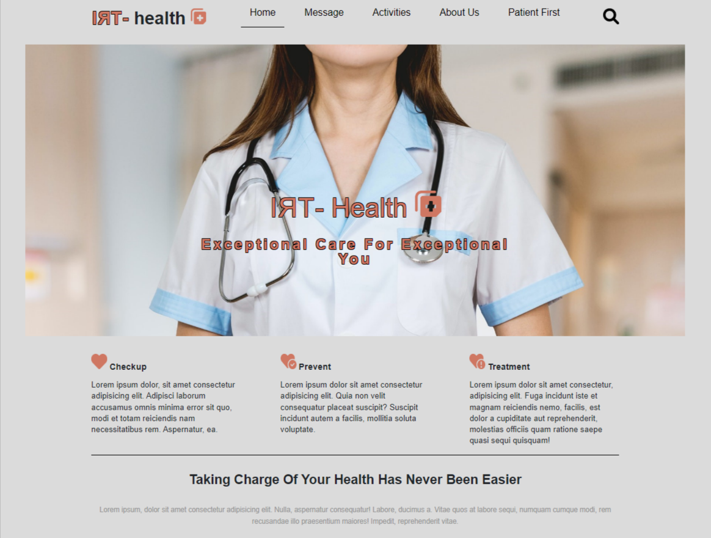

# Tri-Health

## Front End Web App

## Description

Welcome to Tri-Health! This is a website for a fictional healthcare company I created with a Registered Nurse's input.

## Table of Contents

-   [Tri-Health](#tri-health)
    -   [Front End Web App](#front-end-web-app)
    -   [Description](#description)
    -   [Table of Contents](#table-of-contents)
    -   [Purpose](#purpose)
    -   [Usage](#usage)
    -   [License](#license)
    -   [About](#about)
    -   [Badges](#badges)

## Purpose

A company I applied to handed me homework to complete and give back. It was a PSD file which they wanted me to turn into an HTML/CSS website. Some of the criteria for the website included "Modals", "Carousel", and "Responsive Design".  
 
After I returned the homework I was left with the desire to add the assignment to my resume. So I searched online for some templates and created my own version: Tri-Health!

## Usage

Simply visit the website by clicking this [link](https://d-whipp.github.io/tri-health-demosite/) or by visting the URL at (https://d-whipp.github.io/tri-health-demosite/).  
Once there feel free to explore the site. I am still ironing out the responsiveness.

## License

MIT License

Copyright (c) [2022] [David Whipple]

Permission is hereby granted, free of charge, to any person obtaining a copy of this software and associated documentation files (the "Software"), to deal in the Software without restriction, including without limitation the rights to use, copy, modify, merge, publish, distribute, sublicense, and/or sell copies of the Software, and to permit persons to whom the Software is furnished to do so, subject to the following conditions:

The above copyright notice and this permission notice shall be included in all copies or substantial portions of the Software.

THE SOFTWARE IS PROVIDED "AS IS", WITHOUT WARRANTY OF ANY KIND, EXPRESS OR IMPLIED, INCLUDING BUT NOT LIMITED TO THE WARRANTIES OF MERCHANTABILITY, FITNESS FOR A PARTICULAR PURPOSE AND NONINFRINGEMENT. IN NO EVENT SHALL THE AUTHORS OR COPYRIGHT HOLDERS BE LIABLE FOR ANY CLAIM, DAMAGES OR OTHER LIABILITY, WHETHER IN AN ACTION OF CONTRACT, TORT OR OTHERWISE, ARISING FROM, OUT OF OR IN CONNECTION WITH THE SOFTWARE OR THE USE OR OTHER DEALINGS IN THE SOFTWARE.

## About

Hello, my name is David. 
You can email me at dwhipp88@gmail.com. 
You can view my [github](https://github.com/D-Whipp).  
Check out my [portfolio](https://splendid-ganache-f82581.netlify.app/).

## Badges

